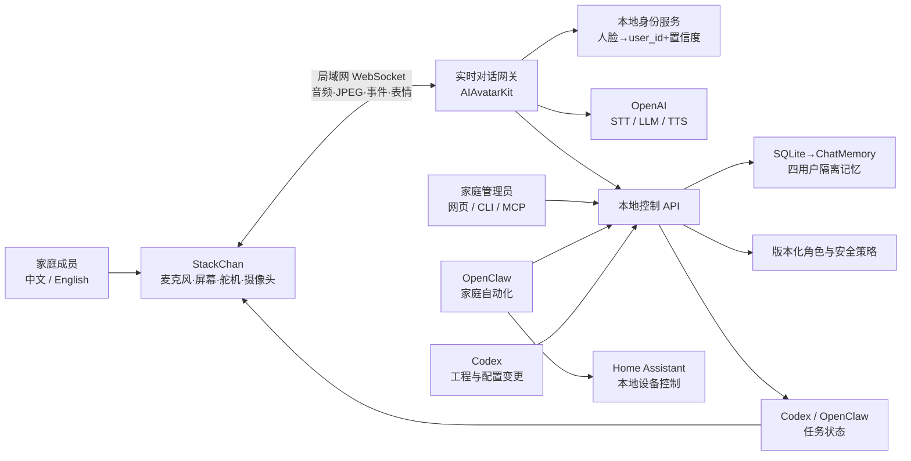

# 系统架构

## 设计边界

Mac 是可信主机；StackChan 是实时交互终端。两者之间只传输短时会话数据、音频、表情、动作和显示状态。身份库、长期记忆、家庭设备权限、OpenAI 密钥与审计日志只保存在 Mac。

## 两条通道

1. 实时通道：机器人采音 → VAD/STT → 身份上下文与记忆 → 模型 → TTS/表情/动作。目标是可打断、首包快、网络异常时安全回到待机。
2. 管理通道：查看 → 提议变更 → 校验 → 生成版本 → 激活 → 评估 → 回滚。Codex 和 OpenClaw 使用相同 MCP 工具，不能绕过版本和审计。

## 当前 M0 + M1 实现

- SQLite 保存角色版本、四用户资料、记忆、任务与审计。
- 配置请求携带 `base_version`，防止两个代理互相覆盖。
- 系统提示按“安全 → 角色 → 回答方式 → 工具策略 → 词汇 → 示例”的顺序组装。
- 儿童或未分配身份的 AI 推断记忆先进入 `pending_review`。
- 机器人显示接口把进行中的 Codex/OpenClaw 任务映射为标题、摘要、进度和表情。
- Mac 提供与官方固件兼容的局域网 WebSocket、心跳和设备资料接口。
- 控制 API 只暴露安全范围内的预设表情、文字和舵机动作；任务状态可自动推送真机。
- 固件使用设备专用密钥认证；上游弱默认密钥、公共服务地址和公共 OTA 地址均被构建覆盖。
- 音频和摄像头帧当前只经过内存且不落盘，为 M2 实时语音保留协议入口。

## 后续替换点

- SQLite 记忆接口保持不变，数据层升级为 ChatMemory + PostgreSQL/pgvector。
- 实时对话网关在 M2 接入 AIAvatarKit 与 OpenAI 语音链路；固件继续保留官方 StackChan BSP 硬件能力。
- 人脸识别仅输出临时 `user_id` 和置信度；低于阈值进入访客会话，不做猜测。
- 家庭设备统一经 OpenClaw → Home Assistant 适配器，危险动作要求成人二次确认。
