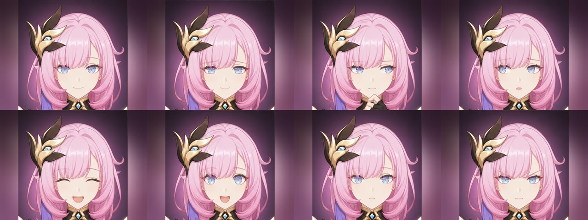

# 爱莉头像与 Agent 情绪显示方案

## 目标

用视频中的爱莉希雅头部特征建立一套适合 StackChan 320×240 屏幕的统一头像。头像只显示颈部以上，确保眼睛、眉毛和嘴部在小屏上仍能清楚表达情绪。

## 视觉来源与处理

- 从用户提供的剧情视频中抽取爱莉希雅正面头肩画面，读取粉色头发、蓝色眼睛、金紫色发饰和服装领口等稳定特征。
- 使用这些视频帧作为身份、配色和游戏 CG 风格参考，生成同一人物、同一角度和同一光照的表情组。
- 移除视频界面、字幕、作者水印和对话框，不直接把带 UI 的视频截图当作机器人头像。
- 最终素材采用 4:3 满屏面部特写，头发直接延伸到屏幕左右边缘；不使用侧边栏、留白或柔化延展区。
- 输出 320×240、Baseline YUV 4:2:0 JPEG；单张约 14 KB，兼容 ESP32 硬件 JPEG 解码器并适合局域网即时传输。

## 情绪集

| 头像 | 含义 | 典型触发 |
|---|---|---|
| `neutral` | 平静、轻微微笑 | 待机、普通回答结束 |
| `listening` | 专注倾听 | 唤醒成功、收音中 |
| `thinking` | 思考 | ASR 完成、模型生成、Agent 运行 |
| `doubt` | 疑问、需要澄清 | 没听清、信息冲突、询问用户 |
| `happy` | 开心 | 任务完成、正向回应 |
| `excited` | 兴奋 | 明显惊喜、主动庆祝 |
| `concerned` | 担忧但温和 | 任务失败、道歉、用户低落 |
| `angry` | 坚定生气 | 明确反对或边界提醒；不表现攻击性 |

## 状态映射

- Codex/OpenClaw 任务运行：`thinking`
- 等待用户补充：`doubt`
- 任务完成：`happy`
- 任务失败：`concerned`
- 语音待命：`neutral`
- 唤醒并倾听：`listening`
- 正在生成回答：`thinking`
- 正在说话：根据实际语音音量驱动闭嘴、半开嘴和张嘴三档口型

## 动画细节

- 语音播放期间，每约 100 毫秒读取一次即将播放的 PCM 音频能量，并选择闭嘴、半开嘴或张嘴帧；口型来自真实语音，不依赖随机定时器。
- 动画更新限制在约 10 FPS，避免头像 JPEG 传输和 ESP32 解码挤占 Opus 音频通道。
- 情绪切换依次播放半眨眼、闭眼、半眨眼三张过渡帧，每帧约 40 毫秒，再显示目标表情。
- 回答结束先恢复闭嘴，再通过眨眼过渡到倾听或待机表情，避免嘴巴停在张开状态。
- 未唤醒待机时，每隔约 4.5–9.5 秒随机播放一次微动作：自然眨眼占 55%，左右查看各占 15%，轻拨头发占 15%。
- 待机动作只在 `waiting_for_wake_word` 状态运行。检测到唤醒词、开始收音、思考、说话或显示任务状态时会立即让位，不覆盖业务表情。

## 技术方案

头像包保存在 Mac，Mac 仍是配置与状态的唯一事实来源。控制服务通过 StackChan 已有的 JPEG 帧和视频覆盖层通道发送当前头像：

1. 发送一张 320×240 JPEG。
2. JPEG 解码完成后打开视频覆盖层，替换默认几何脸。
3. 情绪变化时发送三张轻量过渡帧，再发送目标 JPEG。
4. 关闭覆盖层即可立即回退到原 StackChan 默认脸。

这个方案不把大图写入 ESP32 固件，减少闪存占用和刷机风险；头像包、映射和代码都在 Git 中版本化，可独立更新和回滚。
